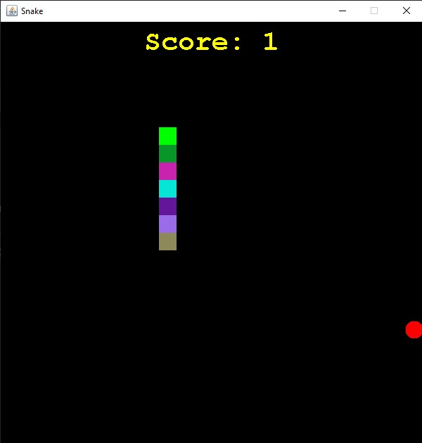

# Java Snake

## Description
A game in Java where the player controls a snake and tries to eat as many apples as possible. Each time the snake eats an apple its body grows. The snake must avoid the walls and its own body or the player loses.

## Screenshots

## Table of Contents
 * [Installation](#installation)
 * [Usage](#usage)
 * [Contributing](#contributing)
 * [Questions](#questions)
        
## Installation
Clone this repository and open folder in appropriate IDE.
   
## Usage
Open SnakeGame.java and run the program. Use the left, right, up, and down arrows on the keyboard to move the snake.

## Contributing
Charity Rogers

## Questions
If you have any questions, please contact me!

  - GitHub: https://github.com/rogerscl116
  - Email: rogerscl116@gmail.com
  
